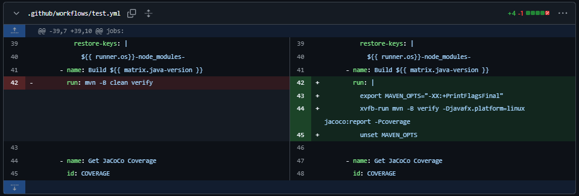
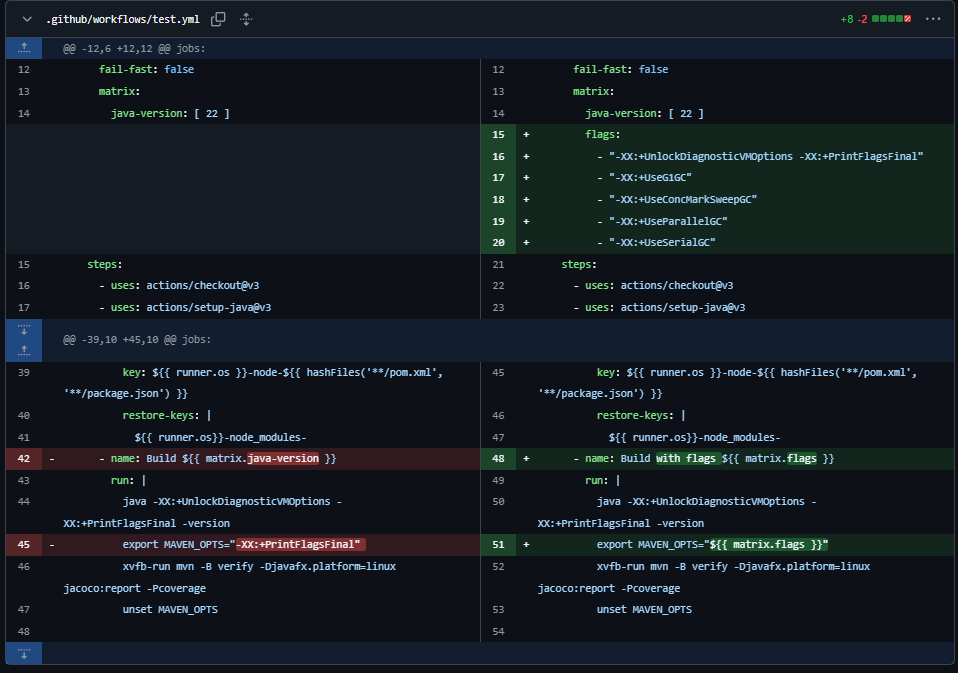

# Documentation pour la tâche 3

## Changements apportés à la Github Action pour permettre l'exécution avec cing flags
En ajoutant le code de l'exemple dans Cryptomator, nous avons réalisé que, pour exécuter un flag spécifique, il fallait le spécifier dans la ligne suivante : `export MAVEN_OPTS="-XX:+PrintFlagsFinal"`.

Pour exécuter les tests en parallèle, nous avons conservé la stratégie déjà implémentée dans notre GitHub Action, qui utilise une matrice. Il fallait définir les flags que nous souhaitions tester en tant que paramètres, et de remplacer `export MAVEN_OPTS="-XX:+PrintFlagsFinal"` par `export MAVEN_OPTS="${{ matrix.flags }}"`.

## Flags ajoutés

### -XX:+UseStringDeduplication
-Ce flag a pour but d'éliminer les String dupliquées afin de réduire l'espace mémoire utilisée. Ce faisant, il ajoute une certaine complexité au garbage collector (GC), ce qui risque d'augmenter le temps où l'application est en pause à long terme si trop peu de gains en mémoire sont faits, mais qui autrement devrait réduire le temps d'exécution totale puisque le GC aura moins de mémoire à regarder pendant sa phase de marquage. En ajoutant le flag supplémentaire `-XX:+PrintStringDeduplicationStatistics`, on pourrait voir les gains faits et le temps d'exécution à des fins de comparaison.

### -XX:+PrintGCDetails
-Ce flag explicite les détails du garbage collecting et permet donc entre autres de voir le temps de pause dû au GC chaque fois qu'une de ces pauses est déclenchée ou encore de voir l'évolution des régions dans le cas où l'on utilise le garbage collector G1. Il nous permet aussi de voir l'évolution de la quantité de mémoire utilisée (et la quantité de mémoire sauvée après l'exécution du GC).

### -XX:+HeapDumpOnOutOfMemoryError
-Ce flag indique à la JVM de générer un heap dump (une représentation de tous les objets dans le tas) au moment où l'application est à court de mémoire disponible. Ceci nous permet de mieux diagnostiquer la suite d'événements ayant mené à l'`OutOfMemoryError`.

### -XX:MaxRAM=1073741824
-Ce flag réduit la quantité maximale de mémoire que la JVM peut utiliser. Ainsi, en établissant une limite assez basse, comme ici à 1GiB, on peut l'utiliser pour s'assurer du bon fonctionnement dans un environnement à faibles ressources.

### -XX:MaxGCPauseMillis=100
-Ce flag vise à suggérer un plafond (soft cap) au temps que le GC prend par pause, plafond que le GC va essayer de respecter. Changer la valeur de ce flag de 200ms (valeur par défaut) à 100ms vient donc réduire le temps de pause maximum attendu, ce qui peut faire en sorte que davantages de pauses soient faites, mais que leur impact individuel sur le temps d'exécution des tests soient diminués.

## Touche d'humour
-Nous avons rajouté un petit message humoristique dans le fichier Yaml de sorte que lorsque la couverture de test ne s'améliore pas, le message indiquant que la couverture ne s'est pas améliorée sera suivie de "Better luck next time!" (meilleure chance la prochaine fois!).